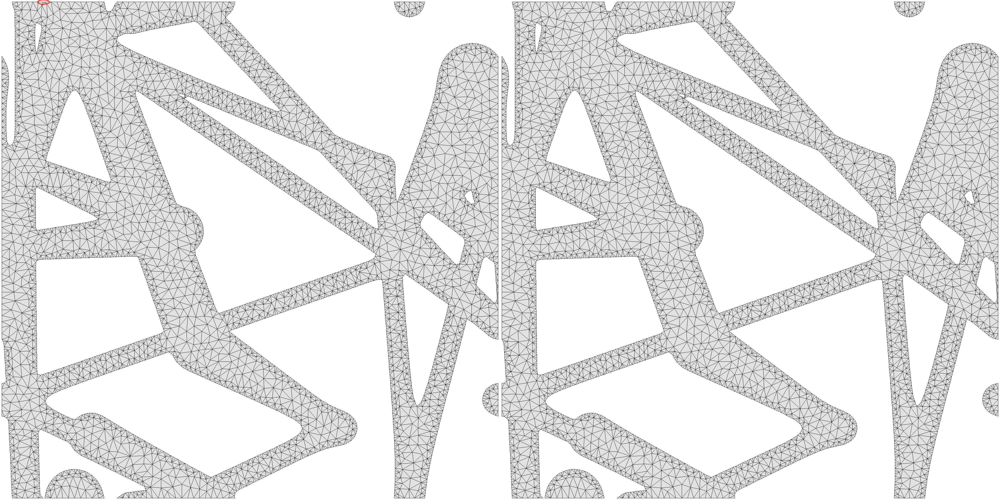

# Common Optimization Problems

Random notes on optimizing a pattern with the `WCSOptimization_cli` program.

#### Inflation graph failure

```
INFLATOR FAILED: Couldn't find 1th periodic-identified node for minimal boundary node 654 at ...
```

If the inflation fails, you can try to increase the ` --inflation_graph_radius` parameters. This sets the number of neighboring edges that is taken into account when evaluating the SDF and meshing the boundary of a pattern.

#### Coarsening and inflation failures

A fairly uncommon cause of aperiodic meshes is the parameter `marchingSquaresCoarsening`. It can cause small contours to be missed on one side of the periodic boundary but not the other.
The contour is detected at a coarser resolution (`2^marchingSquaresCoarsening` times coarser) and then the marching squares is only run at the full `marchingSquareGridSize` resolution around the detected contour.

In the meshing options file, it can be helpful to set `"marchingSquaresCoarsening": 0` instead of 1, as the latter might miss some contours in certain situations (see figure below), resulting in a non-periodic mesh (which produces an inflation error).



#### Reaching a target elastic tensor

Try with `--solver slsqp --TensorFitConstraint` instead of `--JSWeight 1.0`. This will set the tensor matching as an vector equality constraint $$f(x) = 0$$, instead of trying to optimize a scalar $$\min \lVert f(x) \rVert_F$$. In the first form, SLSQP will try to enforce each term to be $$0$$, whereas in the second form, the contribution of each term are averaged out in the final sum.

Note that in this form, there are no objective function to optimize, the solver is just trying to satisfy the constraints.

It can also be helpful to specify the argument `--proximityRegularizationWeight 1.0` as the objective function, penalizes parameters from straying too far from their original values (this probably prevents the solver from getting stuck in impossible configurations).

#### Achieving non-orthotropic tensors

In a flattened 2D elasticity tensor, a orthotropic material will have the following non-zero entries:

$$
\begin{pmatrix}
\star & \star & 0 \\
\star & \star & 0 \\
0     & 0     & \star
\end{pmatrix}
$$

For deformed cells with non-diagonal Jacobians (i.e. cells distorted by shearing), it is impossible to produce an isotropic material using patterns with orthotropic symmetry – you'll need to use the `doubly_periodic` symmetry type. This is because the isotropic target material is made fully anisotropic by the distortion transformation; the $$0$$ entries in the matrix above become nonzero.
Patterns with orthotropic symmetries can only reach tensors with zeros in these entries.

#### Matching interfaces and symmetries

To ensure a consistent interface between opposite sides (ensure border edges are subdivided into the same number of vertices), you need to enable `"forceConsistentInterfaceMesh": true` in the meshing options file, and remove `curveSimplifer": "collapse"`. It is advised to use it only as the final step, to recover the optimized pattern, as it may slightly impact the optimization process.

To have the X boundary match the Y boundary of the cell, you also need to use the option `--symmetry square` (`--symmetry orthotropic` is not enough as it will not enforce reflective symmetry across the diagonals).

#### Meshing resolution

The marching grid resolution is computed from the meshing option `maxArea` by default.
With `forceMSGridSize` you can decouple the boundary resolution from the interior resolution.
With `"forceMSGridSize": true`, the boundary is extracted at the resolution specified by `marchingSquaresGridSize` using the marching square algorithm.

Without `forceMSGridSize`, the marching square resolution is deduced from `maxArea`, and `maxArea` controls the both the interior resolution and the boundary extraction resolution (so that the boundary edges are roughly the same size as the interior edges triangle will create).

I was using `"forceMSGridSize": true` and `"marchingSquaresGridSize": 2048` for stress analysis, but lower resolutions such as 256 or 512 may already provide satisfactory results.
